# IMAX Through the Years

**The giant screen, measured** — a data study of every film released in IMAX from 1994 to 2026.

This project pairs a **dataset** of 1,406 IMAX films (plus the screens that show them and the money they make) with an interactive **dashboard** that turns that data into a fifteen-section visual essay. It answers a simple question with real numbers instead of marketing: what actually makes an "IMAX film" — and what makes one succeed?

The whole thing ships as a **static site** (Next.js → static export, self-hosted Chart.js, works offline) built on top of a **Python scraping/ETL pipeline** that assembles the underlying CSVs.

---

## The IMAX size ladder

"IMAX" on a poster can mean several very different frame sizes, and that difference is the single biggest driver of everything that follows. The key point is that the premium IMAX frame is not *wider* than a normal cinema screen — it is **taller**. Held to the same width, IMAX opens the image vertically, so you literally see more of the scene.

<p align="center">
  
</p>

| Format | Aspect ratio | What it is | Typical screen (this dataset) | Availability |
|---|---|---|---|---|
| **IMAX 1.43:1** | 1.43:1 (tall) | True IMAX — 70mm film or GT dual-laser. The full-height frame films like *Oppenheimer* and *Dunkirk* were shot for. | Median **≈ 447 m²**, ~18 m tall | Rare — only **84 of 492** venues (~17%), and 57% of those in the US/Canada |
| **IMAX 1.90:1** | 1.90:1 | The common digital multiplex IMAX. Taller than scope, but not the full frame. | Median **≈ 197 m²**, ~10 m tall | Most IMAX venues |
| **Standard scope** | 2.39:1 (wide) | Ordinary widescreen — the baseline every other frame is measured against. | — | Every cinema |
| **IMAX Dome** | Dome | A curved planetarium/science-centre screen. Different geometry, so it is not a flat frame. | — | The shrinking institutional tier (3.1% of the network) |

The scarcity compounds: the tall 1.43:1 frame is not only rare, it is also physically **2.3× the screen area** of a typical 1.90:1 house. So when a film is shot in true IMAX, most of the audience — especially outside North America — never sees it at full height.

*The SVG above is self-contained and theme-aware (it adapts to light/dark automatically). Keep it next to the README, or move it into an `assets/` folder and update the image path.*

---

## What the data shows

Most people think "IMAX" means one thing. The central finding of this dataset is that it means at least four very different things, and the difference drives almost everything else.

- **"IMAX" is a ladder, not a label.** A film can be *shot on 70mm IMAX cameras* (the real thing — a taller 1.43:1 frame, you literally see more), *certified digital*, or — for ~71% of the catalogue — an ordinary film run through **DMR** (Digital Media Remastering) and upscaled to fill the screen. Only ~20 films in history were shot on real IMAX film cameras, and even those use the tall frame for only part of their runtime (Dunkirk 75%, Oppenheimer just 22%).

- **How much IMAX footage a film has does *not* predict its gross.** Across the 54 films with a measured IMAX-minutes value, the correlation with worldwide gross is **0.02** — essentially zero. The format decision is artistic, not commercial.

- **What *does* predict reach:** franchise membership (franchise entries median **$709M** vs **$108M** standalone — a 6.5× gap, bigger than any format effect), opening weekend (predicts final worldwide gross at **r = 0.82**), and how many premium formats a film stacks (3D + laser + ScreenX + 4DX climbs cleanly from $28M → $522M median).

- **The network exploded, but productivity fell.** IMAX grew from **225 systems (2001) to 1,865 (2026)** — about 8.5×. Gross-per-screen peaked around 2010 and then dropped: screens outran hits, and the network absorbed a long tail of small releases.

- **The premium frame is rare — and unevenly distributed.** Only **84 of 492** catalogued IMAX venues (**17%**) can project the full-height 1.43:1 frame, and **57%** of those sit in the US and Canada. So when a film is shot in true IMAX, most of the world never sees it that way.

- **IMAX became an international, multilingual business.** International share of gross rose from **28% (2000) to ~65%** by the mid-2010s, and the slate went from <10% non-English to roughly **48% non-English** by 2025–26 (Chinese, Japanese, Hindi, Korean, Telugu, French).

- **It's a hit-driven business.** The top 10% of films (~90 titles) earn **40%** of the **$233B** total gross in the set. 52 billion-dollar films sit atop a base of 233 films that earned under $25M.

- **The prestige tier pays for itself.** True 65mm/camera-shot films return the most per dollar spent (**3.5×** median gross-to-budget, vs 2.85× for DMR and 2.66× for certified digital) — but they're a big-budget privilege: median budget **$165M** vs **$85M** for DMR-only, and 67% of camera-shot films cost $100M+.

- **Marvel is the volume engine.** 41 IMAX films totalling **$35.5B** — more than the next three franchises combined. (Avatar tops the per-film median, but Marvel is the machine.)

- **Screen supply almost mechanically sets film supply.** Films released per year track installed screens at **r = 0.93** — the tightest relationship in the dataset. Roughly every ~100 new screens brings ~5 more IMAX films a year.

- **A clear tentpole calendar.** Summer (May–Jul, ~$370M median) and the November holiday launch ($261M) are the release windows; January is the dead zone at $52M.

- **IMAX's museum roots are being diluted.** Institutional (science-centre / museum) screens fell from **5.8% of the network (2018) to 3.1% (2026)** as commercial multiplexes multiplied — the same "novelty → saturation" shift the DMR pivot showed in the slate.

- **The company's own numbers back it up.** IMAX crossed **$1B in global box office for the first time in 2015** (+31% YoY), and its two biggest quarters on record — $347M (Q3 2023) and $368M (Q3 2025) — are both *post*-pandemic.

### Two findings that are easy to read backwards

- **3D didn't die — it got exclusive.** Its *share of releases* collapsed after 2016 (~70% → the teens), which looks like a fading gimmick. But its *share of revenue* went the other way: the 3D-vs-non-3D gross gap widened from ~2× to nearly **9×** ($432M vs $46M in 2020–26). Studios stopped putting 3D on mid-tier films and reserved it for tentpoles. Same data, opposite conclusion depending on which denominator you pick.

- **The "median gross crash" is volume, not weakness.** The typical IMAX film's gross climbs from $13M (pre-2005) to ~$300M (2010–14), then falls to $84M (2020–26). That drop isn't IMAX declining — it's the slate ballooning (378 films in the latest bucket vs 138 in 2010–14) as the network absorbs a long tail of small releases while the top end keeps growing.

---

## The dashboard

The site reads as a four-act argument. You can scroll straight through or jump to any of the fifteen sections; every chart has a plain-language "how to read this" note, and every IMAX term is defined in an inline glossary.

### Act I — Orientation *(what we're looking at)*
- **What counts as "IMAX," really** — the four-rung capture ladder, drawn to scale, with each tier's real median gross and the per-film 1.43:1 fraction.
- **The DMR pivot** — watch the catalogue invert from museum 70mm originals (pre-2002) to a flood of Hollywood DMR conversions, with the SEC screen count overlaid.

### Act II — What Happened *(formats, network, geography)*
- **Which premium format won** — 3D, IMAX with Laser, ScreenX, 4DX, and Dolby Cinema compared; the post-Avatar 3D bubble inflating and deflating in real data.
- **The maturing network** — falling gross-per-screen and the squeeze of museum/institutional screens (5.8% → 3.1%) by commercial multiplexes.
- **Where the screens actually are** — an **interactive world map** (toggle IMAX vs Dolby, shaded countries vs bubbles) plus head-to-head by country, by region, by format-class, and by physical screen area.

### Act III — Why *(what drives reach)*
- **Does capture type predict reach?** — 900 films with verified grosses, plotted with switchable log / linear / ÷-year-median axes to separate format effect from industry growth.
- **What actually drives reach** — premium-format stacking, the 3D "revenue vs releases" paradox, the IMAX-vs-Dolby co-release premium (3×), and best-projection-tier vs gross.
- **Franchise economics** — the single strongest predictor in the dashboard, plus the biggest franchises on IMAX (Marvel: 41 films, $35.5B).
- **Relationships that actually hold** — scatter plots with fitted trends: screens → films (r = 0.93), opening weekend → final gross (r = 0.82).

### Act IV — So What *(the money and the shape of the business)*
- **Where the money comes from** — the domestic/international shift over time.
- **The economics behind the frame** — return-on-budget by capture type (the prestige 65mm tier returns the most per dollar) and the slate going multilingual.
- **Release rhythm & concentration** — the two-peak tentpole calendar, the box-office pyramid, and revenue concentration.
- **What IMAX itself reports** — the company's *own* quarterly box office read straight from its SEC filings, pandemic gap and all.

### Act V — Your Turn
- **Why a producer green-lights IMAX** — a cost-vs-payoff "producer's ledger" (camera rental, ~10 cameras in existence, screen mismatch vs box-office share and longer legs), ending on disclosed per-film IMAX shares (e.g. *Project Hail Mary* at 20% of the North American debut on ~1% of screens).

---

## The dataset

Everything joins on a normalized `title + year` key, so the film catalogue, the grosses, the venues, the enrichment, and IMAX's financials line up.

| Dataset | What it captures | Rows |
|---|---|---|
| `films_full_from_wikipedia.csv` | **The master film table.** Every film shown in an IMAX cinema 1994–2026, with capture category, IMAX minutes, max aspect ratio, 3D / laser / ScreenX / 4DX flags, China-only flag, and release year. | 1,406 |
| `bom_grosses_verified.csv` | Verified opening-weekend and worldwide grosses (Box Office Mojo), split into domestic and international. | 1,295 |
| `tmdb_enrichment.csv` | Production budget, genre, revenue cross-check, and original language (TMDB). | 1,443 |
| `imax_network_from_edgar.csv` | Worldwide IMAX system counts, year by year, from IMAX's SEC filings. | 164 |
| `imax_economics_from_edgar.csv` | IMAX's own gross box office, per-screen averages, and systems revenue, by filing. | 103 |
| `imax_venues_worldwide.csv` | Every catalogued IMAX theatre with format class, projector, and screen dimensions. | 492 |
| `dolby_venues_worldwide.csv` | Every Dolby Cinema venue worldwide, geocoded to city/country. | 304 |
| `dolby_films_from_wikipedia.csv` | Films released in Dolby Cinema (for the IMAX-vs-Dolby comparison). | 179 |
| `letterboxd_imax_notes.csv` | Per-film IMAX format notes (camera, stock, the 1.43:1 fraction). | 745 |
| `imax_pr_share_hits.csv` / `deadline_share_hits.csv` | Disclosed per-film IMAX box-office share observations. | 73 / 35 |

---

## Tech stack

- **Next.js** (App Router, TypeScript), pinned to `16.3.0-canary.89`, statically exported via `output: "export"`.
- **Chart.js 4.5.1**, self-hosted in `public/vendor/` — no CDN, so the site runs fully offline.
- **Vanilla JS runtime** (`charts.js`, `nav.js`, `settings.js`) for charts, the world map, navigation, and accessibility (theme, text size, OpenDyslexic font, high contrast, reduced motion).
- **Node.js 20**; deploys to **Netlify** as a static site (config in `netlify.toml`).

### Run it

```bash
npm install
npm run dev          # http://localhost:3000

npm run build        # static site → ./out
npx serve out        # preview the export
```

Deploy: push to a Git repo and import it in Netlify (it reads `netlify.toml` automatically), or `npm run build` and drag `out/` onto the Netlify dashboard. No adapter or serverless functions needed.

---

## How it's built

The dashboard does **not** read the CSVs at runtime. The pipeline computes the summary numbers once and bakes them into `public/charts.js` as constants, which keeps the site fully static:

```
Python scrapers  →  scraper_output/*.csv  →  (compute summaries)  →  public/charts.js  →  static site
```

### The pipeline

Each script is independent and writes to `scraper_output/` (override with the `SCRAPER_OUTDIR` env var).

```bash
pip install requests httpx beautifulsoup4 selectolax polars tqdm playwright python-dotenv
playwright install chromium        # only for the Playwright scrapers
```

- `scrape_wikipedia_imax.py` — builds the master film table from Wikipedia's IMAX release lists.
- `scrape_imax_location.py` — IMAX venues + format classes from the community `r-imax/imaxguide` project.
- `scrape_dolby_venues.py` / `scrape_dolby_wiki.py` — Dolby venues (via Dolby's cinema-finder + OpenStreetMap geocoding) and the Dolby film list.
- `scrape_edgar_imax_network.py` — IMAX system counts from every relevant SEC filing (async, rate-limited).
- `imax_data.py` / `scrape_edgar_probe.py` — the SEC **economics** (box office, per-screen, systems revenue). Run with `--probe` first to verify the extraction patterns against live filings.
- `scrape_tmdb_enrich.py` — budgets, genres, and languages from TMDB.
- `scrape_grosses_and_shares.py`, `scrape_imax_probe.py`, `scrape_playwright_v2.py` — verified grosses and per-film IMAX share from Box Office Mojo, IMAX press releases, Deadline, and Letterboxd (`_v2` is current; use `--phases` to rerun a single source).

---

## Sources & licensing

- **Films / Dolby films:** Wikipedia (MediaWiki API)
- **IMAX venues:** [`r-imax/imaxguide`](https://github.com/r-imax/imaxguide) — **CC-BY-SA-4.0** (keep the credit if you publish derived work)
- **Dolby geocoding:** OpenStreetMap Nominatim — **ODbL**
- **Network & financials:** SEC EDGAR (IMAX Corp, CIK 921582)
- **Budgets / genres:** The Movie Database (TMDB)
- **Grosses:** Box Office Mojo

Set your own contact info in each scraper's User-Agent before running — SEC, Nominatim, TMDB, and Wikipedia all ask for it, and the scripts pace requests to stay polite.

---

## Reading the data honestly

The dashboard is explicit about its own limits, and so is the data:

- **A blank IMAX share means "not disclosed," never zero.** IMAX only breaks out per-film share for some wide releases.
- **A TMDB budget of `0` means "unknown," not free.** Budget coverage is thin for older and non-US films.
- **Grosses are nominal** (not inflation-adjusted) and split only domestic vs international — there is no reliable per-country revenue in these sources.
- **Several gaps are selection, not causation.** Dual IMAX+Dolby releases and premium-format stacking correlate with big grosses largely because studios reserve them for films already expected to be huge.
- **The SEC economics patterns need verification.** Run the `--probe` mode and confirm the matches before trusting the full extraction.